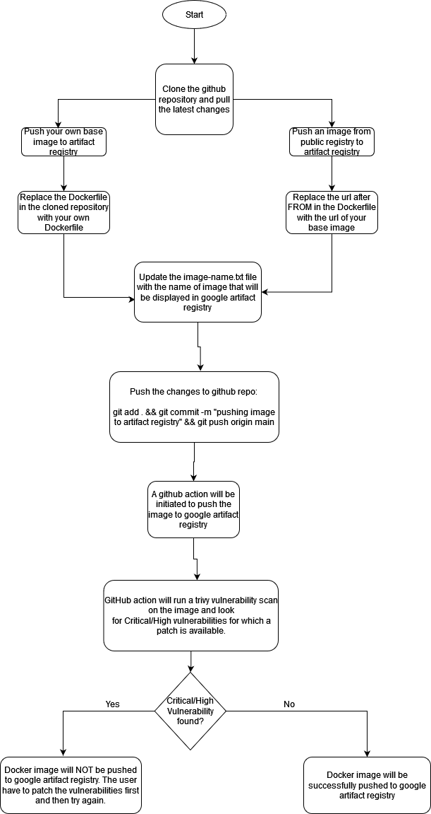

# Google Artifact (Central Base Image) Registry
Google Artifact Registry is a container registry that allows you to store and manage base images in a central location, which can be used by different teams and projects within an organization. In this ReadMe.md, we will briefly discuss the benefits of using a central base image registry, operational workflow to build and upload images to the registry, pull and use images, and best practices for building container images.

### Benefits of using a Central Base Image Registry

A central base image registry offers the following benefits:

* **Standardization**: A central base image registry provides a single source of truth for base images, allowing you to standardize the base images used across different teams and projects.
* **Security**: By storing base images in a central registry, you can easily manage and control access to these images.
* **Efficiency**: With a central base image registry, you can avoid duplicating the same base images across different projects, which can save you time and resources.
* **Versioning**: A central base image registry allows you to version your base images, making it easier to track changes and rollbacks.

### Operational Workflow

The following steps outline the operational workflow for building and uploading images to the central artifact registry:

1. **Build your container image**: You can use a Dockerfile or any other tool to build your container image.
2. **Clone the Repository**: Run the following command- git clone https://github.com/$$$$$$/$$$$$.git
3. **Pull the latest changes**: Run the following comamnd- git pull https://github.com/$$$$$$$/$$$$$$.git
4. **Replace the Dockerfile**: If you have your own Dockerfile for the base image, replace the Dockerfile in the cloned repository with your own Dockerfile and update the image-name.txt file with the name of image that will be displayed in google artifact registry
5. **Edit the Dockerfile**: If you want to use a base image from internet, edit the url after FROM in the Dockerfile and update the image-name.txt file with the name of image that will be displayed in google artifact registry
6. **Push the changes**: Run the following command with a message of your choice to push the changes to main branch- git add . && git commit -m "pushing image to artifact registry" && git push origin main
7. **GitHub Action**: A github action will be initiated that will build the dockerfile and push the image to google artifact registry as soon as you push the changes to main branch on github. 
8. **Trivy Vulnerability Scanner**: GitHub action will run a trivy vulnerability scan on the image and look for Critical/High vulnerabilities for which a patch is available. If a vulnerability is found, docker image will NOT be pushed to google artifact registry. The user have to patch the vulnerabilities first and then try again.

### Using base distroless images from GCP artifact registry
Use the following command for using an image from registry:
FROM $$$$$/$$$$$/$$$$$/{IMAGE-NAME}:{TAG}

### Best Practices for Building Container Images

To ensure that your container images are secure, efficient, and portable, you should follow these best practices:

* **Use minimal base images**: Start with a minimal base image to minimize the attack surface and reduce the image size.
* **Remove unnecessary components**: Remove any components that are not required for your application to reduce the image size.
* **Use multi-stage builds**: Use multi-stage builds to separate the build environment from the runtime environment and reduce the image size.
* **Scan for vulnerabilities**: Use vulnerability scanning tools to scan your images for vulnerabilities.
* **Version your images**: Version your images and use specific tags for each version.
* **Use secrets**: Use secrets to pass sensitive information such as passwords and API keys to your application.
By following these best practices, you can ensure that your container images are secure, efficient, and portable.

### Contacts

Cybersecurity team

Central GAR is an essential tool for managing base images across different teams and projects within an organization. By standardizing your base images and following best practices for building container images, you can ensure that your images are secure, efficient, and portable.
